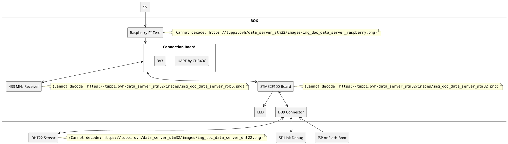
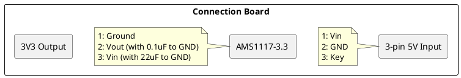

*Last update on 24/04/2020*

# Introduction

The Data Server project is created to make some statisctics on internal temperature sensor (DHT22) and external temperature sensor (LaCrosse). The data from these sensors is sent to a Raspberry PI. The last one integrates a Python application which logs received data to a database. This application can also receive external commands by Telegram, for example, to update the site from the database data.

# Modules

### 3V3

A component used to transform 5V into 3V3 is AMS1117-3.3. 

### DB9 Connector

Pin  &nbsp; &nbsp; &nbsp; | Name  &nbsp; &nbsp; &nbsp; &nbsp; &nbsp; &nbsp; &nbsp; &nbsp; | Wire Color
------|------|------
1 | 3V3 | Yellow / Ree
2 | SWCLK | Yellow / Violet
3 | SWDIO | Violet 
4 | DHT_DATA | Grey
5 | BOOT0\* | Blue 
6 | N.C. | -
7 | N.C. | -
8 | N.C. | -
9 | GND | Black

*\* BOOT0: 0 – FLASH, 1 – ISP*

### LED 

The user LED is connected between 3V3 and the pin PA12 (output) via a 330 Ohm resistance. The used LED is a low cost one with working  voltage about 1V9.

### DHT22 Sensor

This sensor permits to measure the temperature and the relative humidity. 

Pin  &nbsp; &nbsp; &nbsp;| Name 
------|------
1 | 3V3
2 | DATA
3 | NC
4 | GND

It is recommended to pullup the DATA signal to 3V3 by 1k resistance. But it works also without this resistance. 

The DATA signal is input/output. So, for the simplicity, it is connected to two STM32 pins: one as STM timer input (PA15) and another to STM32 output (PA8). 

The timer is used to measure the pulse duration.

### 433 MHz Receiver

Pin  &nbsp; &nbsp; &nbsp; | Name 
------|------
1 | Antenna
2 | GND
3 | GND
4 | 3V3
5 | 3V3
6 | DER\*
7 | DATA
8 | GND

*\* DER: 1) Data output-default;  2) Battery Saving Mode*

The DATA signal is connected to STM32 input pin (PA2).

### Raspberry PI Zero

The Raspberry PI Zero has two USB ports. One is connected to the +5V power. Another is connected to CH340C for UART communication. It is important to rely pins 4 and 5 of the second USB to enable the OTG mode.

### STM32F100 Board

Pin &nbsp; &nbsp; &nbsp; | I/O &nbsp; &nbsp; &nbsp; &nbsp; &nbsp; | Description
------|------|------
PA2  | Input  | 433MHz receiver
PA8  | Output | DHT22 conversion start
PA12 | Output | LED
PA15 | Input  | DHT22 data 

The code source can be found here: [https://github.com/tuppi-ovh/data-server-stm32](https://github.com/tuppi-ovh/data-server-stm32).

### Connection Board

# Source Code 

Source code of this project: 

- [https://github.com/tuppi-ovh/data-server-stm32](https://github.com/tuppi-ovh/data-server-stm32)

- [https://github.com/tuppi-ovh/data-server-pi](https://github.com/tuppi-ovh/data-server-pi)

# Conclusion

The board has been working good since several months. All components can be replaced by more common ones: CH340C by FTDI, STM32F100 by another STM32 board.

I put everything in two identical plastic boxes:

At the end these plastic boxes were relied together:

# Interesting Links

- [DHT22 with STM32](https://www.controllerstech.com/temperature-measurement-using-dht22-in-stm32)

- [MySensors API UART](https://www.mysensors.org/download/serial_api_20)

